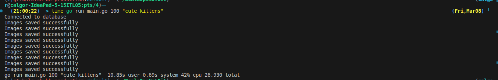
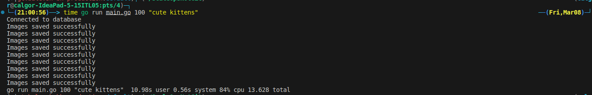
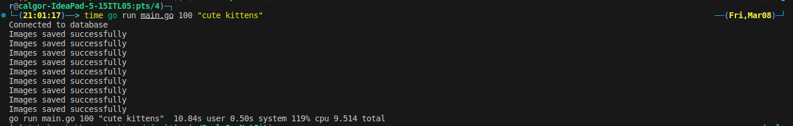
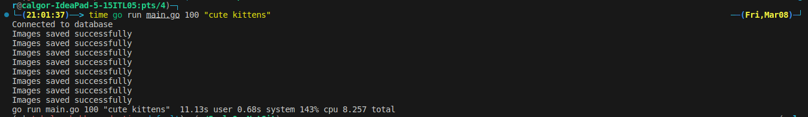

Image Downloader with Go and Pipeline Pattern
=================================================

This project is an image downloader built with Go, leveraging pipeline concurrency patterns to enhance speed and efficiency. The downloader follows a structured process consisting of three main steps: downloading images concurrently, resizing them, and finally saving them onto a PostgreSQL database.

### Pipeline Concurrency Pattern

The pipeline concurrency pattern is a powerful technique for enhancing efficiency in concurrent programming. By breaking down complex tasks into smaller, manageable stages and processing them concurrently, we maximize resource utilization and minimize overall execution time. In this project, the pipeline pattern enables us to seamlessly orchestrate image downloading, resizing, and database insertion, thereby optimizing performance and scalability.

### Architecture Overview

The architecture of the image downloader is designed to accommodate high throughput and scalability. Here's a brief overview of the key components:

1.  **Image Downloading**: Multiple goroutines are employed to download images concurrently, leveraging the inherent parallelism of Go's concurrency model. This approach significantly reduces download times, especially when dealing with a large number of images. As you can se here


### 5 goroutines downloading 100 images



### 10 goroutines downloading 100 images



### 20 goroutines downloading 100 images



### 30 goroutines downloading 100 images

    
2.  **Image Resizing**: After downloading, images are resized as per the specified dimensions or quality requirements.
    
3.  **Database Insertion**: To efficiently save images onto a PostgreSQL database, a batch insertion strategy is adopted. Images are inserted in batches, with a configurable batch size, and a 1-second timer ensures controlled insertion rates, preventing overload and maintaining database responsiveness.


### Running the Image Downloader

To run the image downloader, you need to have Docker and Docker Compose installed on your system. Once you have these prerequisites in place, follow these steps:

1.  Clone the repository and navigate to the project directory.
2.  Remember to add your own serpapi API key in the `docker-compose.yml` file. You can get the API key from [here](https://serpapi.com/).
3.  First, build the Docker image by running the following command:

    ```bash
    docker build -t scaleops .
    ```
4.  Run the following command to start the application(You can Change the number of images and the query string from docker-compose.yml):

    ```bash
    docker compose up ImageDownloader
    ```

5.  The application will start and begin downloading images from the specified URLs. You can monitor the progress in the terminal, and the images will be saved to the PostgreSQL database.


### Database Schema

The PostgreSQL database schema consists of a single table, `images`, with the following columns:    

-   `url`: The URL from which the image was downloaded. It serves as the primary key.
-   `content`: The byte array representation of the image.


### More about the project's features

1- As you know each tcp connection handshake takes about 1.5RTT (Round Trip Time) and it's a lot of time for a single image. So by Batch Insertion, we can reduce the number of connections to the database and increase the speed of the insertion process by 2.18 times.

2- By adding more goroutines to the image downloading process, we can increase the speed of the image downloading process by 3.5 times. You can fine-tune the number of goroutines to suit your specific requirements and optimize performance.

3- The application is designed to be highly configurable, with parameters such as the number of goroutines, batch size, and database connection string being easily adjustable. This flexibility allows for fine-tuning the application to suit specific requirements and optimize performance.

4- As you know google has banned the access to the images from the google search apis, so you can't use google developers tool. But After some of research, I found a way to fetch the image urls from the google search page. I used the `https://serpapi.com/search.json` URL to fetch the urls from the google search page.

5- If you want do not want to signup to serpapi to get the API key, you can use mine for testing purposes. But I recommend you to use your own
My API key: `cb6e6914bd4a5b1396cf8f7bc6d55af947ffbe2136b1241b2287a842d8698b05`


### To-Do

-   Add more Unit Tests
-   Benchmark the application with different image sizes and download URLs
-   Add support for NoSQL databases like Scylla and Cassandra
